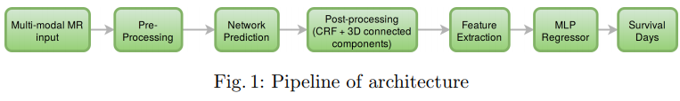

# Ensemble-of-Deep-2D-and-3D-Fully-Convolutional-Neural-Network-for-Brain-Tumor-Segmentation

This repo utilize a ensemble of 2-D and 3-D fully convoultional neural network (CNN) for segmentation of the brain tumor and its constituents from multi modal Magnetic Resonance Images (MRI). The dense connectivity pattern used in the segmentation network enables effective reuse of features with lesser number of network parameters. On the BraTS validation data, the segmentation network achieved a whole tumor, tumor core and active tumor dice of 0.89, 0.76, 0.76 respectively.

# Pipeline

# Results

## Contact 

* Avinash Kori (avinashgkori@smail.iitm.ac.in)
