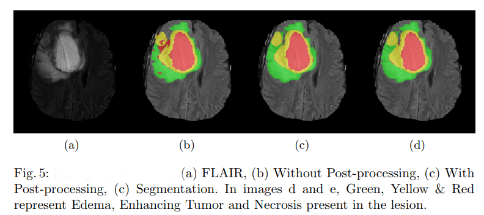
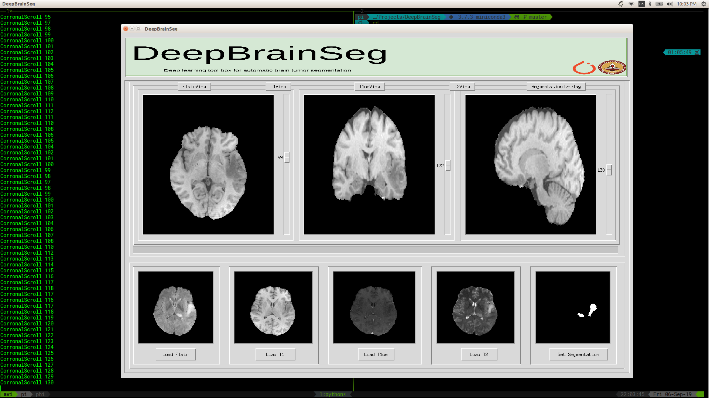
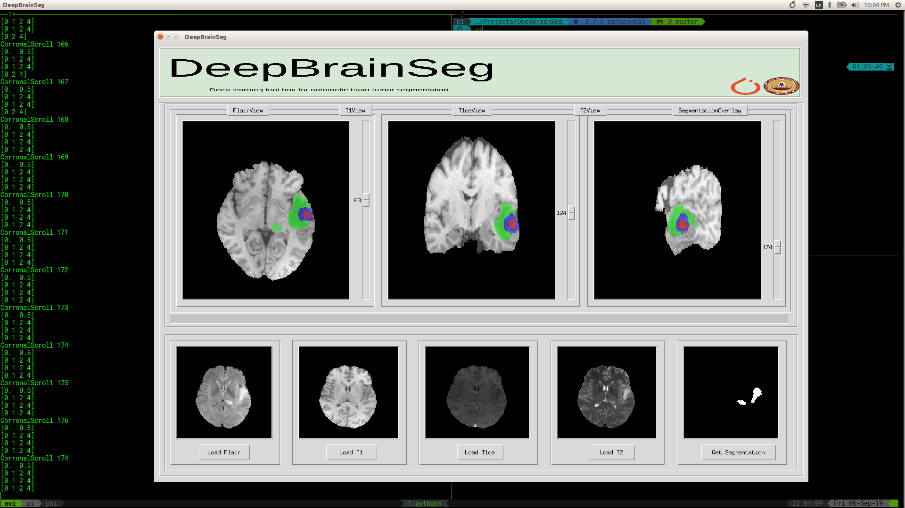

# DeepBrainSeg

[](https://travis-ci.org/koriavinash1/DeepBrainSeg)
[](https://badge.fury.io/py/DeepBrainSeg)
[](https://opensource.org/licenses/MIT)


This repo utilize a ensemble of 2-D and 3-D fully convoultional neural network (CNN) for segmentation of the brain tumor and its constituents from multi modal Magnetic Resonance Images (MRI). The dense connectivity pattern used in the segmentation network enables effective reuse of features with lesser number of network parameters. On the BraTS validation data, the segmentation network achieved a whole tumor, tumor core and active tumor dice of 0.89, 0.76, 0.76 respectively.

## Features

- [x] Brain Tumor Segmentation
- [x] Brain Mask Generation SkullStripping (currently using HD-BET and ANTs)
- [x] Radiomic Features
- [x] Coregistration
- [x] Dcm and nifty support (converts dcm to nifty and works)
- [x] UI based inference framework
- [ ] Whole Brain Segmentation


## Installation

PyPi based installation:

> python version: 3.5

> installation: ```pip install DeepBrainSeg```

or 

```
git clone https://github.com/koriavinash1/DeepBrainSeg.git
cd DeepBrainSeg
python3 setup.py install
```

<hr>

## Citation

If you use DeepBrainSeg, please cite our work:

```
@inproceedings{kori2018ensemble,
  title={Ensemble of Fully Convolutional Neural Network for Brain Tumor Segmentation from Magnetic Resonance Images},
  author={Kori, Avinash and Soni, Mehul and Pranjal, B and Khened, Mahendra and Alex, Varghese and Krishnamurthi, Ganapathy},
  booktitle={International MICCAI Brainlesion Workshop},
  pages={485--496},
  year={2018},
  organization={Springer}
}
``` 

## Pipeline for Segmentation


## Results for Segmentation




## UI
We also provide UI based tool for tumor segmentation visualization. It can be used by running the following commands after cloning the repo.

```
cd ui
python3 DeepBrainSegUI.py
```




## Python API usage

### Brain tumor segmentation

> for data in BraTs format
```
from DeepBrainSeg import deepSeg
segmentor = deepSeg(quick=True)
segmentor.get_segmentation_brats(path)
```

<hline>

> for other formats
```
from DeepBrainSeg import deepSeg
t1_path = 
t2_path = 
t1ce_path = 
flair_path = 

segmentor = deepSeg(quick=True)
segmentor.get_segmentation(t1_path, t2_path, t1ce_path, flair_path, save = True)
```

<hline>

### brain seq coregistration to t1c
```
from DeepBrainSeg.registration import Coregistration
coreg = Coregistration()

moving_imgs = {'t1': t1path,
               't2': t2path,
               'flair': flairpath}
fixed_img =  os.path.join(t1cpath)
coreg.register_patient(moving_images    = moving_imgs,
                            fixed_image = fixed_img,
                            save_path   = pathtosave)
```
<hline>
  
### brain mask extraction (skull stripping)
```
from DeepBrainSeg.brainmask.hdbetmask import get_bet_mask
from DeepBrainSeg.brainmask.antsmask import get_ants_mask

get_bet_mask(vol_path, savepath)

or 

get_ants_mask(vol_path, savepath)
```

### Radiomics feature exctractor
```
from DeepBrainSeg.radiomics import ExtractRadiomicFeatures

extractor = ExtractRadiomicFeatures(input_mask=None, 
                                    save_path=None, 
                                    seq='Flair',
                                    class_ = 'ET')
extractor.first_order()
extractor.glcm_features()
extractor.gldm_features()

or

extractor.all_features()
```

## Steps followed for tumor segmentation inference:

+ Our algorithm makes use of ANTs framework for mask generation. First call deepSeg class build ANTs framework locally in ~/.DeepBrainSeg
+ First call deepSeg downloads all pretrained models locally in ~/.DeepBrainSeg
+ Final segmentation is the result of ensemble of 4 different models:
    + ABLNet (modelABL.py, Air brain Lesion Network)
    + 3DBrainNet (model3DBNET.py, 3D multiresolution CNN)
    + Tiramisu2D (modelTis2D.py, 57 layered 2D CNN)
    + Tiramisu 3D (modelTir3D.py, 57 layered 3D CNN)
+ Extensive documentation will be uploaded soon, along with transfer learning framework
+ More details about network architecture and training procedure can be found [here](https://link.springer.com/chapter/10.1007/978-3-030-11726-9_43)

### For training code please refer this [repo](https://github.com/koriavinash1/BraTs2018)

## Windows 10 Installation Guide


**Figure_0**: DeepBrainSeg starting up on Windows 10.


**Figure_1**: DeepBrainSeg used to get brain segmentation on Windows 10. (Note: Ensemble segmentation/inference takes ~2 hours via torch_cpu, on my i7 6700 intel cpu. Torch cuda/gpu on the other hand, is much faster, with ensemble segmentation/inference taking only ~10 minutes, on my gtx 1060 3gb)

Installation Guide: https://github.com/JordanMicahBennett/DeepBrainSeg/blob/master/WINDOWS%2010%20INSTALLATION%20GUIDE.md

## Contact 
* Avinash Kori (koriavinash1@gmail.com)
